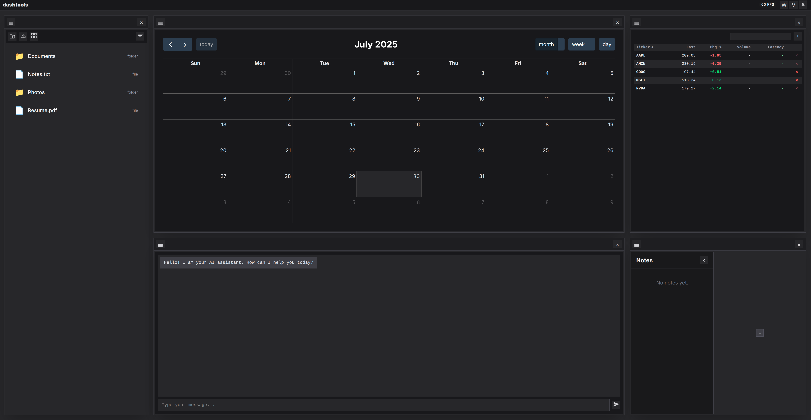

<div align="center" style="width: 100%; margin: auto;">
  
  <p style="text-align: left; font-size: 1.1em; margin-top: 1.5em; margin-bottom: 1.5em;">
  <br>personal dashboard for the web. might become an os, might become something else.<br><br>
  have a feature request? open a pr!<br>
  want to contribute? pick an issue here:<a href="https://docs.google.com/spreadsheets/d/1XUoftVHcUJMHeDANr0ILYpizxWe7MGualURjd7_FDlM/edit?usp=sharing>"> bounty link</a> <br> 
  want to test it out? click here: <a href="https://dashtools.vercel.app/">demo link</a>
  <br><br>
  </p>
  
</div>

## Getting Started

To install and run Dashtools locally:

```bash
# 1. Clone the repository
git clone https://github.com/tylerguest/dashtools.git
cd dashtools

# 2. Install dependencies
npm install

# 3. Start the development server
npm run dev
```

</div>

